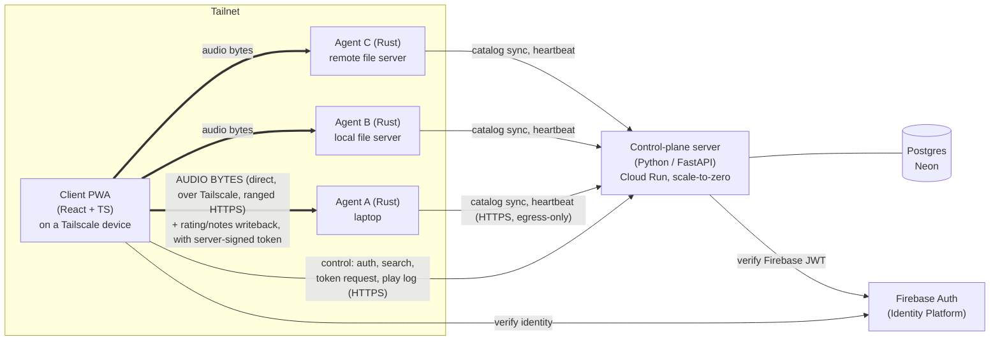

# Architecture & v0 Build Plan

A modular, self-hosted, multi-source music streaming system for personal use.
The reason this project exists: a large, growing music collection spread across
multiple machines that the owner wants to **stream, rate, and annotate from
anywhere**, with ratings and notes stored durably **inside the files
themselves** rather than trapped in a proprietary library database.

---

## 1. Guiding principles

1. **In-file metadata is the source of truth.** Ratings, notes, and play stats
   live in standard in-file tags. No dependency on any single application's
   private database. The library is portable by design.
2. **The server is a control plane, never a data plane.** It handles auth,
   catalog/search, agent registry, and logging. Audio bytes never pass through
   it. This is what keeps it cheap (scale-to-zero) and simple.
3. **Tailscale is the network fabric.** Clients, agents, and the owner are all on
   one tailnet. Any client can reach any agent — directly on the LAN when
   co-located, via Tailscale's relays when not. Tailscale also provisions valid
   TLS certificates for agents, which removes the browser mixed-content problem.
4. **Everything is modular.** Three independently deployable components with
   clean contracts, so any one can be swapped or re-hosted (e.g. the server
   container could be self-hosted on the tailnet instead of Cloud Run).
5. **Security is a first-class requirement**, applied throughout — not bolted on.

---

## 2. v0 scope

### In scope
- One-rating-per-track (0–5 stars), notes, play count, last-played — all written
  into the files.
- Library browse + search (artist, album, title, rating, year, notes, genre).
- Direct streaming from agent to client over Tailscale, with seek.
- Progressive playback: start as soon as enough is buffered, finish downloading
  the full file in the background, and pre-buffer the **next** track once the
  current one is fully buffered.
- Authentication (Firebase Auth, Google sign-in) with `admin` / `user` roles.
- Admin-only agent registration.
- Multiple agents; each agent's copy of a file is its own catalog entry.

### Explicitly out of scope for v0 (deferred)
- Server-relay streaming fallback. (Tailscale makes it unnecessary; clients must
  be on the tailnet.)
- On-the-fly transcoding for browser compatibility.
- FLAC→ALAC conversion + master deletion. **Under review** — with Music.app
  dropped and ALAC offering no size or compatibility gain over FLAC, this feature
  currently has no clear rationale.
- Cross-agent deduplication of identical files.
- Multi-track (N>1) look-ahead prefetch. (v0 does single-track look-ahead.)
- Music.app / Apple library synchronization. If ever wanted, a **separate local
  importer** would push in-file ratings into Music.app's database; it is not part
  of this system.
- Native mobile app and reliable mobile background audio. (Best-effort via PWA +
  Media Session API; the primary target is desktop browser.)

---

## 3. System overview



The thick edges are the **data plane** (client ↔ agent, over Tailscale). The thin
edges are the **control plane** (everything ↔ server). The server is never on a
thick edge.

---

## 4. Components

### 4.1 Server — Python (FastAPI) on Cloud Run

Scale-to-zero, public HTTPS endpoint, managed TLS. Responsibilities:

- **Auth enforcement.** Verifies the Firebase JWT on every request; maps the
  Firebase UID to an `admin`/`user` role.
- **Agent registry.** Admin-only registration of agents. Stores each agent's
  tailnet hostname, a **hash** of its bearer token, and liveness (`last_seen_at`).
- **Catalog + search.** Ingests catalog deltas pushed by agents; serves search
  over Postgres full-text (`tsvector` + `pg_trgm` for fuzzy) and structured
  filters (rating, year, etc.). Works even for tracks whose agent is offline.
- **Capability-token signing.** Issues short-lived, single-use, Ed25519-signed
  tokens scoped to one action on one track/agent (stream, or rate/notes write).
  Logs the play at token-issuance time.
- **Play / stats log.** Records play events; reflects the authoritative in-file
  values reported back by agents.

The server holds no audio and never proxies a stream.

### 4.2 Agent — Rust, single self-contained binary

Runs on Linux/macOS/Windows/FreeBSD. Egress-only to the public internet; accepts
inbound connections **only from the tailnet**. Responsibilities:

- **Library scan.** Enumerates its configured roots; records path, size, mtime,
  format, and parsed metadata. Full scan on start + periodic incremental
  (mtime-based) + manual trigger.
- **Catalog sync.** Pushes deltas to the server over authenticated HTTPS using
  its per-agent bearer token. Sends a periodic heartbeat for liveness.
- **JIT audio hashing.** Computes each track's stable audio-stream hash **lazily**
  — piggybacked on the first full read for streaming, so no separate scan pass.
  For FLAC, the decoded-audio MD5 is read directly from the `STREAMINFO` block
  (free). Results are cached locally (SQLite) keyed by `path+size+mtime`, so
  re-tagging (mtime changes, audio doesn't) recomputes to the **same** hash,
  proving identity survived the tag write.
- **Streaming.** Serves ranged HTTPS on its `*.ts.net` name (valid Let's Encrypt
  cert via Tailscale), verifying the server-signed capability token per request.
- **Metadata writeback.** Writes rating/notes/play-count into the source file
  using the format-specific tag map (§7), on presentation of a valid write token.

### 4.3 Client — React + TypeScript PWA

Runs in the browser on any Tailscale-enabled device (desktop primary, mobile
best-effort). Responsibilities:

- **Auth.** Firebase Auth (Google sign-in).
- **Browse / search.** Talks to the server; caches the last-known catalog so a
  server cold-start or brief outage doesn't block browsing.
- **Playback engine.** Requests a stream token from the server, fetches the file
  **directly from the agent** over Tailscale. Progressive start + full in-memory
  buffer + single-track look-ahead prefetch. Seek is client-side within the
  buffered file (with ranged fallback for pre-buffer seeks).
- **Rating / notes UI.** Requests a write token, sends the change to the agent,
  and reflects the confirmed in-file value.
- **Play logging.** Reports plays to the server.

---

## 5. Key data flows

**Agent registration (admin-only).** Admin registers an agent → server generates
a one-time bearer token (stores only its hash) and returns it + the server's
token-signing **public keys** (both the Ed25519 and the ML-DSA halves of the
hybrid pair, published JWKS-style) → admin installs the token and the current key
set into the agent config.

**Catalog sync.** Agent → server, authenticated by bearer token. Server upserts
catalog entries and updates liveness.

**Search / browse.** Client → server (Firebase JWT). Postgres full-text +
filters. Returns entries with their owning agent and online/offline status.

**Play.** Client → server: "issue stream token for entry X." Server verifies
role, logs the play, returns a single-use hybrid-signed token (`jti`, short TTL).
The client `fetch()`es the file from the agent with the token in an
`Authorization` header (never in the URL) and feeds the bytes into the audio
element via its buffer; the agent verifies **both** signatures + `jti` freshness,
then streams ranged bytes.

**Rate / notes.** Client → server: "issue write token, rating=N, entry X." →
client → agent → agent writes the tag, re-reads to confirm, returns the new
value → server reflects it (from the agent's next sync or the client's report).

---

## 6. Security model

- **User auth:** Firebase Auth / Identity Platform, Google sign-in. Server
  verifies the Firebase JWT on every request. Roles: `admin`, `user`.
- **Agent → server auth:** per-agent bearer token (long random secret), stored
  as a hash on the server, sent over TLS. Admin-issued at registration,
  rotatable. Adding agents is admin-only.
- **Client → agent auth:** signed **capability tokens** minted by the server and
  verified by the agent. Each token is:
  - **hybrid-signed** — signed with **both Ed25519 and ML-DSA (FIPS 204)** over
    the same payload; the agent requires *both* signatures to verify. Hybrid means
    the token is no weaker than classical if either scheme is later broken. The
    format is **crypto-agile**: an explicit `alg` field, a key-ID, a pluggable
    verifier, and JWKS-style key distribution, so algorithms/keys rotate (e.g.
    adopting FN-DSA once FIPS 206 is final) without a format change.
  - **header-transported** — carried in an `Authorization` header, never in the
    URL. The client uses `fetch()` (not a raw `<audio src>`), so it can set
    headers; this keeps multi-KB signatures out of access logs and off URL-length
    limits. The writeback path is a `fetch` POST, so its token is header/body too.
  - **scoped** — one action (`stream` | `write`) on one specific track/agent;
  - **short-lived** — ~60–120s TTL, gating request *initiation* only (a transfer
    may outlast the TTL, since the token is checked once on arrival);
  - **single-use** — carries a `jti` nonce; the agent keeps a small in-memory,
    TTL-evicted cache of seen `jti`s and rejects replays. Single-use is *per
    token* and each request gets a freshly-minted token, so adding extra ranged
    requests later (e.g. jump-ahead seeks) doesn't conflict with single-use.
    Because the client fetches each file in one shot, the token is effectively
    dead the instant the fetch is accepted — no revocation call needed.
- **Transport:** HTTPS everywhere. Agents terminate TLS with a Tailscale-issued
  Let's Encrypt cert for their `*.ts.net` name (valid in the browser). Server
  uses Cloud Run's managed cert.
- **Network boundary:** agents are egress-only to the internet and accept inbound
  only from the tailnet. Streaming and writes additionally require a valid
  server-signed token, so the tailnet is defense-in-depth, not the sole control.
- **Secrets:** GCP Secret Manager for the server's hybrid signing keypairs
  (Ed25519 + ML-DSA private keys), Firebase
  config, DB credentials, and agent-token hashes. No secrets in source. Terraform
  reads from Secret Manager. Agents store their bearer token with restrictive
  file permissions (OS keystore where available).
- **Data hygiene:** parameterized queries only; strict input validation; **no
  sensitive data in URLs at all** — capability tokens travel in headers, so
  nothing sensitive lands in access logs or hits URL-length limits.

---

## 7. Metadata handling

**Critical premise, verified:** Apple's Music.app does **not** store ratings,
play count, or play date in the file — it keeps them in its own library database
and ignores in-file rating frames. Therefore in-file ratings are for *our*
ecosystem (our client + other standard players), not for Music.app. This is an
accepted, deliberate design choice: the file is the source of truth, and the
phone player is our own client. Notes are the exception — the comment field *is*
a standard in-file tag that most software, including Music.app, reads.

**Tag map (to be finalized and verified in the Milestone 0 spike):**

| Field        | MP3 (ID3v2)        | FLAC (Vorbis comments) | M4A / ALAC (MP4 atoms)            |
|--------------|--------------------|------------------------|-----------------------------------|
| Rating       | `POPM` frame       | `RATING` comment       | freeform `----` atom (no standard)|
| Notes        | `COMM` frame       | `COMMENT` comment      | `©cmt` atom                       |
| Play count   | `PCNT` frame       | custom comment         | freeform `----` atom              |
| Last played  | custom `TXXX`      | custom comment         | freeform `----` atom              |

**Rating byte convention (MP3 `POPM`, de-facto Windows/WMP mapping for max
interop):** 5★=255, 4★=196, 3★=128, 2★=64, 1★=1, unrated=0. A fixed namespacing
email identifies our writes. FLAC/M4A rating scales are standardized and
documented by us since no cross-vendor standard exists.

**Track identity:** the audio-stream hash (see §4.2). Until a track is first
played/rated, it carries a provisional path-based id, reconciled to the canonical
hash on first interaction — which aligns naturally with rating (rating a track
reads and writes it, producing the hash).

---

## 8. Data model (sketch — refined via Alembic migrations)

Postgres on **Neon** (serverless, scale-to-zero, standard Postgres). Portability
to Cloud SQL is preserved by: a repository/data-access layer, standard-Postgres
features only, and SQLAlchemy + Alembic. Swapping providers is a
connection-string + Terraform change.

- `user_roles(firebase_uid PK, role, created_at)` — identity itself lives in
  Firebase; this maps UIDs to `admin`/`user`.
- `agents(id PK, name, tailnet_hostname, token_hash, status, last_seen_at,
  registered_by, created_at)` — only the token *hash* is stored.
- `catalog_entries(id PK, agent_id FK, audio_hash, relative_path, title, artist,
  album, album_artist, year, genre, duration_secs, format, size_bytes, mtime,
  hash_computed BOOL, rating, notes, play_count, last_played_at, lifecycle_state,
  created_at, updated_at)` — one row per (agent, file). Rating/notes/play stats
  here are a **cached reflection** of the in-file source of truth, updated on sync
  and writeback. `lifecycle_state ∈ {available, converting, quarantined}`.
- `play_events(id PK, catalog_entry_id FK, firebase_uid, played_at, source)`.

Full-text search: a generated `tsvector` over title/artist/album/notes, plus
`pg_trgm` indexes for fuzzy matching.

---

## 9. Tech stack

- **Client:** React + TypeScript, PWA. Media Session API for lock-screen
  controls. Architected with a clean UI ↔ transport/playback split so a future
  native shell can reuse the logic.
- **Server:** Python + FastAPI on Cloud Run. SQLAlchemy + Alembic. Firebase Admin
  SDK for JWT verification. **Hybrid token signing** (Ed25519 + ML-DSA): Ed25519
  via `cryptography`/PyNaCl; ML-DSA via `liboqs-python` (or check the pinned
  `cryptography` version for native ML-DSA). If Python PQC-signing maturity is
  a concern, factor signing into a tiny Rust helper the server shells out to.
- **Agent:** Rust, on the async **Tokio** runtime. HTTP server (axum/tower-http,
  with built-in ranged file serving); hashing and full-file reads run on
  `spawn_blocking`/a worker pool, never the reactor. **Hybrid token verification**
  via `ml-dsa`/`libcrux-ml-dsa` (the latter formally verified — attractive here)
  plus Ed25519. Metadata via `lofty` + format-specific handling verified in the
  spike. Local SQLite for the hash cache. (All Rust PQC crates are still
  unaudited — pin versions and track advisories.)
- **DB:** Neon (Postgres).
- **Auth:** Firebase Authentication / Identity Platform.
- **Network:** Tailscale (MagicDNS + `tailscale serve` HTTPS on agents).
- **Infra:** Terraform. **CI/CD:** GitHub Actions.

### Repo layout (monorepo)

```
.
├── server/                 # FastAPI service (Cloud Run)
├── agent/                  # Rust binary
├── client/                 # React + TS PWA
├── shared/                 # API contracts (OpenAPI), token format spec
├── infra/                  # Terraform (GCP project, Cloud Run, Neon, Firebase, Secret Manager)
├── spikes/
│   └── metadata/           # Milestone 0 throwaway
├── docs/
│   └── ARCHITECTURE.md      # this file
└── .github/workflows/      # lint, test, build, deploy
```

---

## 10. v0 milestone plan

Each milestone has an acceptance criterion suitable for CI gating.

**M0 — Metadata compatibility spike (risk retirement, first).**
Throwaway tool that writes rating/notes/play-count/last-played into real MP3,
FLAC, and M4A(ALAC) files and reads them back, confirming round-trip in our
target readers. Produces the finalized tag map (§7) and byte mappings.
*Accept:* all four fields round-trip correctly in all three formats; documented.

**M1 — Repo + IaC + CI/CD skeleton.**
Monorepo, Terraform for GCP project / Cloud Run / Neon / Firebase / Secret
Manager, GitHub Actions for lint+test on push and deploy on main.
*Accept:* `terraform apply` stands up an empty HTTPS server; CI runs green.

**M2 — Server control-plane core.**
Firebase JWT middleware + roles; schema + migrations; admin-only agent
registration; catalog ingest; search; **hybrid (Ed25519 + ML-DSA)
capability-token signing** with a crypto-agile `alg`/key-ID format and a
JWKS-style public-key endpoint; play-log endpoint.
*Accept:* an admin can register an agent, ingest a catalog, search it, and mint a
token that verifies on both signatures; a non-admin cannot register an agent.

**M3 — Agent core.**
Bearer-token auth to server; scan; catalog sync + heartbeat; lazy hashing
(STREAMINFO MD5 for FLAC) on `spawn_blocking`; Tailscale HTTPS with ranged
streaming; capability-token verification (**both** hybrid signatures, read from
the `Authorization` header, + `jti` single-use); rating/notes/play-count
writeback via the M0 tag library.
*Accept:* agent registers, syncs a catalog, serves a token-gated ranged stream,
and writes a rating that round-trips in-file and re-reads correctly.

**M4 — Client PWA core (end-to-end thread).**
Firebase login; browse + search UI; playback engine (progressive start + full
buffer + next-track prefetch); token flow; direct streaming with seek; stars +
notes writeback; play logging; offline catalog cache.
*Accept:* log in → browse → search → play with seek from a real agent → rate a
track and confirm the star persists in the file and play count increments.

**M5 — Hardening & resilience.**
Agent online/offline status and "source offline" states; batch token pre-fetch
for queue resilience across server cold-starts; minimal admin UI for agent
registration; a security review pass.
*Accept:* browsing and queued playback survive a cold/absent server; an offline
agent is shown correctly and its tracks fail gracefully.

---

## 11. Deferred / future work

- **FLAC→ALAC conversion + master deletion** — *under review*; currently no clear
  rationale given lossless-to-lossless parity and the removal of Music.app. If
  pursued, use verify-then-quarantine-then-purge; never hard-delete the only copy.
- On-the-fly transcoding for browser-incompatible codecs (agent-side ffmpeg or
  pure-Rust decode).
- Cross-agent deduplication and "pick the reachable/closest copy."
- Multi-track (N>1) look-ahead prefetch; gapless.
- Playlists, queue management, smart playlists by rating/year/notes.
- Native mobile client and reliable background audio.
- Per-user ratings (would move ratings out of files into the DB — currently
  intentionally one-rating-per-track, in-file).
- Optional Music.app importer (separate local tool).
- mTLS for agent↔server (deferred in favor of bearer tokens to avoid a
  load-balancer cost; revisit as a hardening step).

---

## 12. Open questions / known risks

- **Mobile web background audio** remains unreliable, especially on iOS Safari.
  Treated as best-effort until a native client exists.
- **Music.app in-file behavior** is assumed from consistent (incl. 2026) sources
  but confirmed empirically in M0 against the owner's exact version.
- **Cold-start latency** (~1–2s on the first server request after idle) is
  accepted in exchange for near-zero idle cost; mitigated by client-side catalog
  caching and token pre-fetch.
